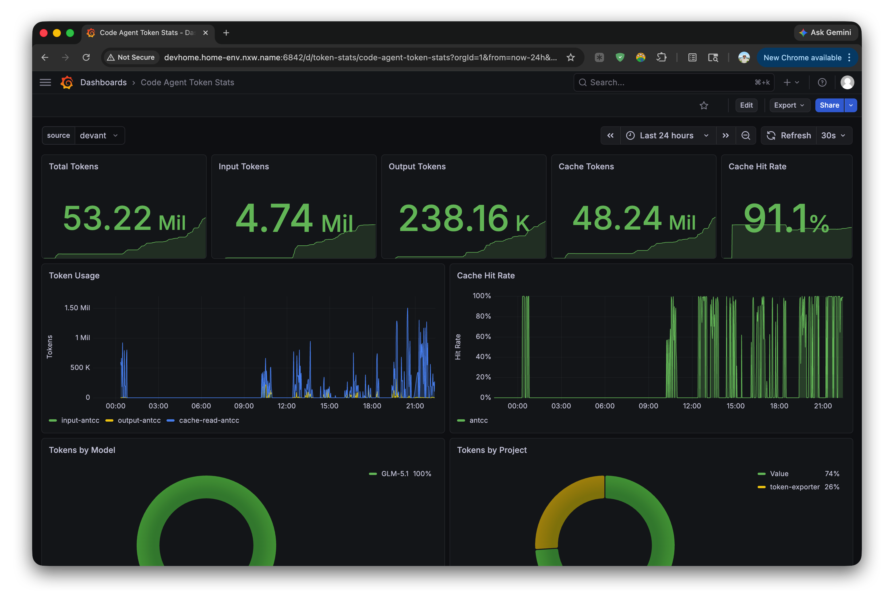

# Token Exporter

A Prometheus exporter that watches Claude Code, AntCC, Codex, and CodeFuse Codex JSONL conversation files and exposes token usage metrics.

## Grafana Dashboard



Import `grafana/dashboards/token-stats.json` or use the included provisioning. The dashboard includes:

- **All Agents** — combined summary stats and per-agent timeseries
- **Per-Agent Groups** — auto-generated sections for each agent (antcc, cc, codex, antcodex) with:
  - Summary stats: total, input, output, cache tokens, cache hit rate
  - Token Usage chart — stacked timeseries of input/output/cache read/cache creation
  - Cache Hit Rate chart — `cache_read / (cache_read + input)` over time
- Filterable by **source**

## Features

- Tracks input, output, cache creation, and cache read tokens per agent and model
- Tracks cost in USD
- Supports multiple agents: Claude Code, AntCC (CodeFuse), Codex, CodeFuse Codex
- Configurable source label for multi-machine setups
- Daily token gauges for historical queries
- Persists watcher state to avoid double-counting JSONL history after restarts
- Grafana dashboard included

## Quick Start

```bash
# Build and push
make
make push

# Run locally
docker run -d \
  --name token-exporter \
  --net host \
  -v ~/.claude:/root/.claude:ro \
  -v ~/.codefuse:/root/.codefuse:ro \
  -v ~/.codex:/root/.codex:ro \
  -v ~/.token-exporter:/etc/token-exporter \
  -e SOURCE=devhome \
  xavierniu/token-exporter:latest
```

## Configuration

| Env Var | Default | Description |
|---|---|---|
| `LISTEN_PORT` | `14531` | Prometheus metrics port |
| `WATCH_INTERVAL` | `5` | Seconds between file checks |
| `CLAUDE_CONFIG_DIR` | `~/.claude,~/.codefuse/engine/cc,~/.codefuse/engine/codex,~/.codex` | Comma-separated config directories (Claude Code/AntCC use `projects/` subdirs, Codex/CodeFuse Codex use `sessions/` subdirs) |
| `DAYS_BACK` | `7` | Days of history to scan on startup |
| `SOURCE` | `""` | Source label for multi-machine setups |
| `STATE_FILE` | `~/.token-exporter/state.json` (`/etc/token-exporter/state.json` in Docker) | JSON state file for processed offsets, dedup keys, and Codex cumulative counters |

## Metrics

| Metric | Type | Labels |
|---|---|---|
| `codeagent_input_tokens_total` | Counter | source, agent, project, model |
| `codeagent_output_tokens_total` | Counter | source, agent, project, model |
| `codeagent_cache_creation_tokens_total` | Counter | source, agent, project, model |
| `codeagent_cache_read_tokens_total` | Counter | source, agent, project, model |
| `codeagent_cost_usd_total` | Counter | source, agent, project, model |
| `codeagent_daily_input_tokens` | Gauge | source, agent, project, model, date |
| `codeagent_daily_output_tokens` | Gauge | source, agent, project, model, date |
| `codeagent_daily_cache_creation_tokens` | Gauge | source, agent, project, model, date |
| `codeagent_daily_cache_read_tokens` | Gauge | source, agent, project, model, date |
| `codeagent_daily_cost_usd` | Gauge | source, agent, project, model, date |

## Docker Compose

```bash
docker compose up -d
```

This starts the exporter, Prometheus, and Grafana together.
